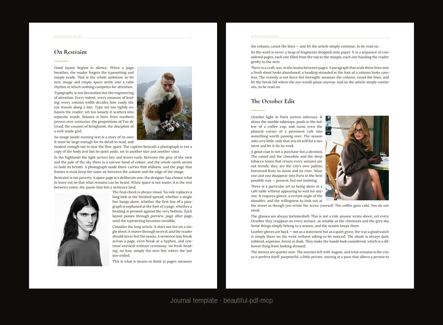
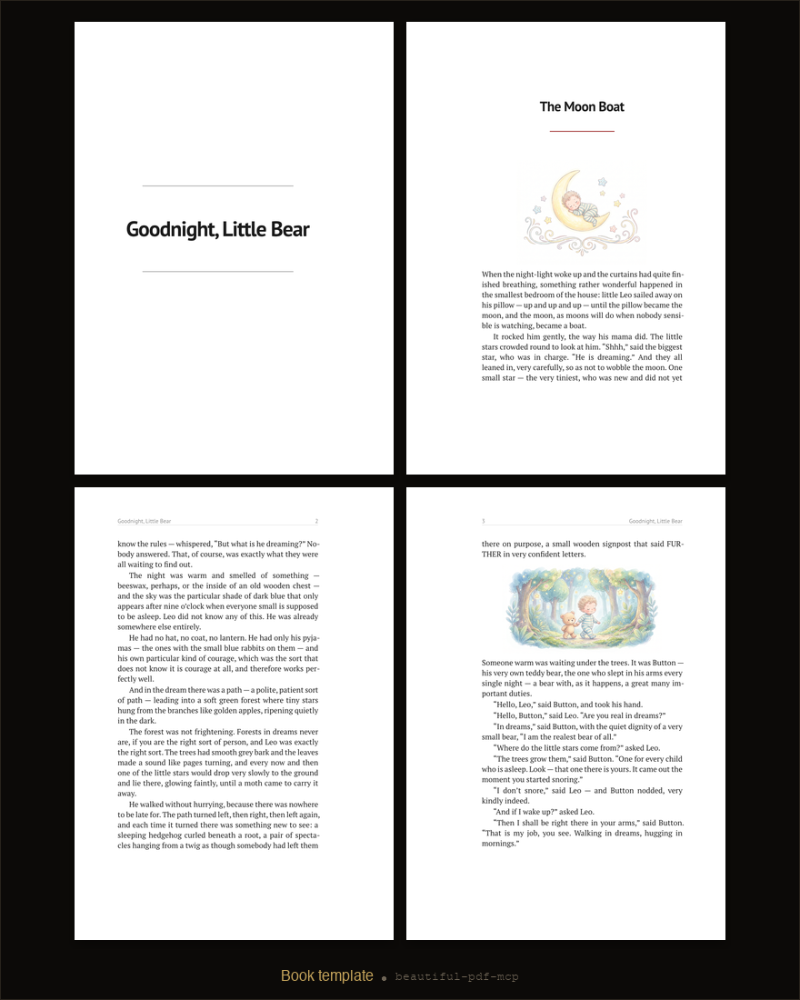

<div align="center">
  
</div>

# 📄 beautiful-pdf-mcp

[](LICENSE)
[](https://python.org)
[](https://typst.app)
[](https://modelcontextprotocol.io)
[](#-templates)

> MCP server that lets AI agents produce **print-ready, typographically correct PDFs** — magazine spreads, GOST lab reports, books, resumes — compiled by [Typst](https://typst.app), not an HTML export dressed up as a document.

## 🧠 The idea: the page is the unit of design

Most generated documents are built the lazy way: stack blocks on a canvas and let them fall where they may. The result is familiar — a heading stranded at the bottom of a page, an image floating in a half-empty sheet, a paragraph that trails off into nothing.

This engine thinks the way a magazine make-up editor does, **one page at a time**:

1. **Budget first.** Before any text is written, `estimate_page_budget` measures how many words fit one page of the chosen template — so content is written *to size*, not trimmed after the fact.
2. **Fill the page like a block.** Every page inside a continuous flow is composed to the bottom of the type area. The leftover text carries to the next page as plain prose — mid-sentence, even mid-hyphen, exactly like a printed book. Tails are normal; holes are not.
3. **Verify, then ship.** Every compile returns a per-page `layout_report` (fill %, holes, defects). The agent inspects rendered pages as PNGs and fixes problems *before* the user ever sees them. `strict_layout: true` refuses to produce a defective PDF at all.
4. **Two-pass image placement.** The compiler tracks the position of every paragraph, computes where each image actually lands, and recompiles with explicit placements — so a photo never tears the layout or strands itself on an empty page.

## 📸 Showcase

<div align="center">
  
  <p><em>Journal: text wraps around photos, justified type with no rivers, the article flows page to page</em></p>
</div>

<div align="center">
  
  <p><em>Book: A5, mirrored Van de Graaf margins, chapter typography, illustrations interleaved into the story</em></p>
</div>

Two of eight templates shown — run [the test suite](#-testing) to render them all.

## ✨ Features

- 📐 **Page-as-canvas engine** — budget → compose → per-page QC → two-pass image placement. Every sheet is a finished block, not an accident.
- 🖼️ **Magazine spreads** — two photos placed diagonally with one continuous text threading around both, powered by [meander](https://typst.app/universe/package/meander/); single photos get true side-wrap via [wrap-it](https://typst.app/universe/package/wrap-it/).
- 📏 **Auto-fit single-page documents** — a short resume or letter measures itself and scales typography up until the sheet is gracefully full.
- 🎓 **GOST 7.32 compliance** — sections on fresh pages, figures after first mention, full-width tables with captions above: Russian academic standards enforced structurally. Works in English and Russian (`language: "en"` switches Figure/Table/Contents labels).
- ✂️ **No rivers, ever** — justified text uses aggressive hyphenation costs so lines pack tight instead of stretching into word gaps.
- 🔁 **Deterministic re-rendering** — the document state lives in JSON; every edit re-lays-out the whole document by the rules, so nothing ever "drifts apart".

## 🚀 Quick Start

### Prerequisites

- Python 3.10+
- [Typst](https://typst.app) — `brew install typst` (or [download a release](https://github.com/typst/typst/releases))

### Installation

```bash
git clone https://github.com/Kreminskaya/beautiful-pdf-mcp.git
cd beautiful-pdf-mcp
pip install -r requirements.txt
```

### Connect to your agent

Add to your MCP client config (Claude Desktop: `~/Library/Application Support/Claude/claude_desktop_config.json`, Cursor: `~/.cursor/mcp.json` — same JSON for any stdio MCP client):

```json
{
  "mcpServers": {
    "beautiful-pdf": {
      "command": "python3",
      "args": ["/absolute/path/to/beautiful-pdf-mcp/src/server.py"]
    }
  }
}
```

Restart the client — tools appear as `beautiful-pdf__*`. Then just ask your agent:

> *"Make me a magazine-style PDF article from these three photos and this text."*

## 📚 Templates

| Template | Use case | Format | Body font |
|---|---|---|---|
| `report` | Business report, analytics | A4 | Source Serif 4 |
| `academic_ru` | Thesis, lab report (GOST 7.32, en/ru) | A4 | PT Serif 14pt |
| `book` | Long-form, fiction & non-fiction | A5 | PT Serif |
| `technical` | API docs, developer guides | A4 | IBM Plex Sans |
| `portfolio` | Portfolio, showcase | A4 | Noto Sans |
| `letter` | Official correspondence | A4 | Source Sans 3 |
| `journal` | Magazine / editorial layout | A4 | Lora + Cormorant |
| `resume` | Modern two-column CV | A4 | IBM Plex Sans |

All 21 fonts ship with the repo — output is identical on every machine.

## 🛠️ How agents use it

```python
budget = estimate_page_budget(template="journal", language="en")
# → words_per_page, lines_per_page: write the article TO BUDGET

doc = create_document(title="Between Rock and Sky", template="journal",
                      language="en", preset_overrides={"accent_color": "#c4a35a"})
sid = add_section(doc_id, "On Restraint", ARTICLE_WRITTEN_TO_BUDGET, level=1)["section_id"]
add_image(doc_id, sid, "photo1.png")      # photos embed into the running text
add_image(doc_id, sid, "photo2.png")      # second photo → diagonal spread

result = compile_preview(doc_id, pages="1-3")
# → PNG per page + layout_report: fill % and defects for every page

compile_pdf(doc_id, "article.pdf", strict_layout=True)
# refuses to ship a PDF with underfilled pages or layout holes
```

The loop is the point: **budget → compose → look → fix → ship**. The agent reads
the `layout_report` numbers (words to add, lines short), inspects the rendered
pages, and iterates until every page is a clean block.

<details>
<summary>🧰 Full tool list (16 tools)</summary>

| Tool | Description |
|---|---|
| `estimate_page_budget` | Words/lines that fit one page of a template — call before writing |
| `create_document` | Create a document, returns `doc_id` |
| `add_section` | Add a section (Markdown content) |
| `update_section` | Update a section's title or text |
| `remove_section` | Remove a section |
| `add_image` | Image with optional caption, width, position (`auto`, `after:N`, wraps, `top`) |
| `add_gallery` | Grid of images |
| `add_table` | Table with headers and rows |
| `add_code_block` | Syntax-highlighted code |
| `add_callout` | Callout box (info / warning / tip / danger / quote) |
| `compile_preview` | Render pages to PNG + per-page `layout_report` QC |
| `compile_pdf` | Final PDF; `strict_layout=True` fails on layout defects |
| `save_document` / `load_document` | Persist / restore document state as JSON |
| `get_document_state` / `list_documents` | Inspect session state |

</details>

<details>
<summary>🎛️ Per-document style overrides</summary>

Any preset key can be overridden per document via `preset_overrides`:

```python
create_document(..., preset_overrides={
    "accent_color": "#2a9d8f",        # brand colour
    "page_num_position": "bottom-center",  # or top-left … bottom-right, none
    "header_rule": False,             # drop the thin running-header line
    "show_header_footer": False,      # no furniture at all
    "body_font": "PT Serif",
    "margin_left": "3.5cm",
})
```

</details>

<details>
<summary>📐 How the page engine works</summary>

Each template declares a **page contract** (`data/styles.json`): what a finished
page looks like for that genre — fill thresholds, tolerated underfill, whether a
final chapter page may end early (a book chapter can; a hole mid-article cannot).

Compilation is **two-pass**: pass 1 renders the document with invisible
per-paragraph position marks, the server queries where every paragraph and image
actually landed, computes optimal `after:N` anchors for `position: "auto"`
images, and pass 2 recompiles with explicit placements. The QC
(`src/layout_qc.py`) then grades every page against the contract and reports
exact numbers — *"page 3: 6 lines short, add ~40 words"* — so the agent can fix
layout arithmetically instead of guessing.

The full specification lives in [docs/SPEC_PAGE_FILL.md](docs/SPEC_PAGE_FILL.md)
(in Russian — the project's design constitution is [CONCEPT.md](CONCEPT.md)).

</details>

## 🧪 Testing

```bash
python3 tests/render_all.py            # render every template to PNG + page QC
python3 tests/render_all.py journal    # one template
python3 tests/render_all.py showcase   # hand-finished showcase documents
```

Every page of every template is rendered to `tests/output/` and graded by the
page-fill QC — the test fails if any page violates its template's contract.

## 🗺️ Roadmap

- [x] 8 templates with shipped fonts
- [x] Page-as-canvas layout engine (meander spreads, auto-fit, GOST structure)
- [x] Page budget + per-page fill QC + `strict_layout`
- [x] Two-pass compilation with automatic image placement
- [ ] Bibliography tool with GOST citation style (`gost-r-705-2008-numeric`)
- [ ] Typst 0.15 upgrade (multiple bibliographies, variable fonts)
- [ ] Decorative drop caps for the book template
- [ ] More CV layouts (single-column, photo-left)

## 🧱 Tech Stack

| Layer | Technology |
|---|---|
| Typesetting | [Typst](https://typst.app) 0.14+, [meander](https://typst.app/universe/package/meander/), [wrap-it](https://typst.app/universe/package/wrap-it/) |
| Server | Python, [FastMCP](https://github.com/jlowin/fastmcp) |
| Layout QC | `typst query` position marks + per-page fill grading |
| Imaging | Pillow (aspect detection, preview pipeline) |
| Fonts | PT, IBM Plex, Source, Noto, Lora, Cormorant — bundled |

## 📄 License

MIT — see [LICENSE](LICENSE).

---

⭐️ If this saves you from one more ugly AI-generated PDF — star the repo!
