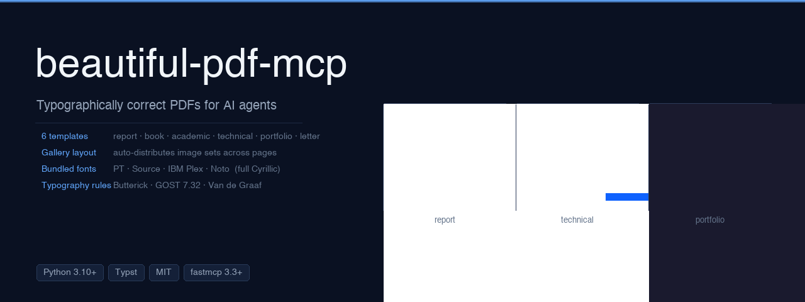
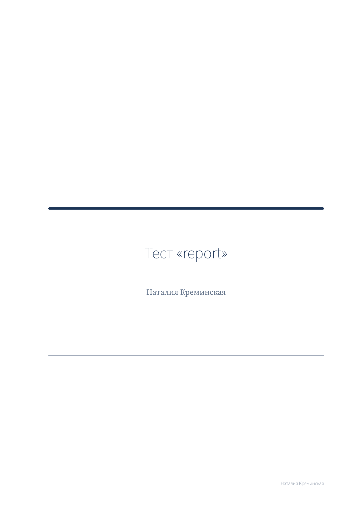
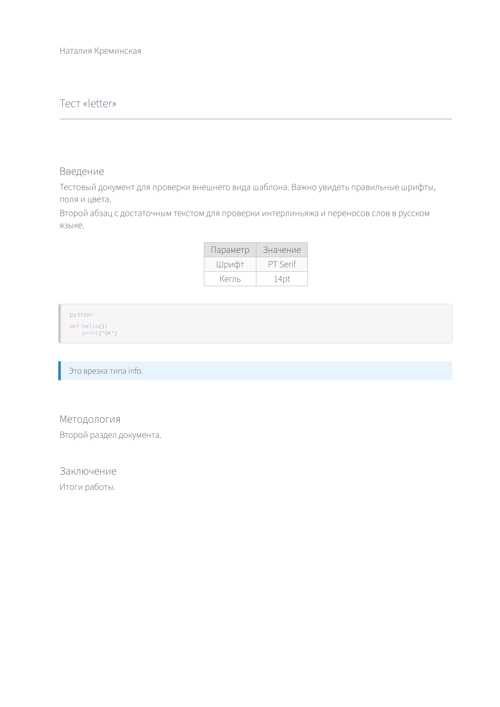

# beautiful-pdf-mcp



MCP server for generating typographically clean PDFs via [Typst](https://typst.app). Gives any MCP-compatible AI agent the ability to produce print-ready documents — with correct fonts, margins, and spacing — not just styled HTML exports.

## Why

Most AI-generated documents look like Word drafts: Times New Roman, 100% black text, no hierarchy. The gap between "LLM output" and "designer output" isn't about tools — it's about knowing a few hundred years' worth of typographic rules and applying them consistently.

This server encodes those rules (Butterick, Bringhurst, GOST 7.32, Van de Graaf canon) into presets and exposes them as MCP tools. The agent picks a template, feeds content, and gets a PDF compiled by a real typographic engine.

## Templates

| Template | Use case | Format | Body font |
|---|---|---|---|
| `report` | Business report, analytics | A4 | Source Serif 4 |
| `academic_ru` | Thesis, research paper (GOST 7.32) | A4 | PT Serif 14pt |
| `book` | Long-form, non-fiction | A5 | PT Serif |
| `technical` | API docs, developer guides | A4 | IBM Plex Sans |
| `portfolio` | Portfolio, showcase | A4 | Noto Sans |
| `letter` | Official correspondence | A4 | Source Sans 3 |

## Previews

<table>
<tr>
<td><br><sub>report</sub></td>
<td><br><sub>academic_ru</sub></td>
<td><br><sub>technical</sub></td>
</tr>
<tr>
<td><br><sub>book</sub></td>
<td><br><sub>portfolio</sub></td>
<td><br><sub>letter</sub></td>
</tr>
</table>

## Requirements

- Python 3.10+
- [Typst](https://typst.app) — `brew install typst` or [download](https://github.com/typst/typst/releases)
- `pip install fastmcp Pillow`

## Installation

```bash
git clone https://github.com/your-username/beautiful-pdf-mcp
cd beautiful-pdf-mcp
pip install -r requirements.txt
```

Verify Typst is available:
```bash
typst --version  # should print 0.12.0 or higher
```

## Claude Desktop config

Add to `~/Library/Application Support/Claude/claude_desktop_config.json`:

```json
{
  "mcpServers": {
    "beautiful-pdf": {
      "command": "python3",
      "args": ["/absolute/path/to/beautiful-pdf-mcp/src/server.py"]
    }
  }
}
```

Restart Claude Desktop. You should see 10 new tools starting with `beautiful-pdf__`.

## Tools

| Tool | Description |
|---|---|
| `create_document` | Create a new document, returns `doc_id` |
| `add_section` | Add a section with Markdown content |
| `update_section` | Update title or content of an existing section |
| `remove_section` | Remove a section from the document |
| `add_image` | Add an image (PNG, JPG, SVG) with caption |
| `add_gallery` | Add a grid of images — auto-distributes across columns |
| `add_table` | Add a table with headers and rows |
| `add_code_block` | Add a syntax-highlighted code block |
| `add_callout` | Add a callout box (info / warning / tip / danger / quote) |
| `compile_preview` | Compile first page as PNG — check layout before final |
| `compile_pdf` | Compile the final PDF |
| `save_document` | Export document state to JSON for persistence |
| `load_document` | Restore a previously saved document |
| `get_document_state` | Inspect current document state |
| `list_documents` | List all active documents in session |

## Usage

```python
# Create a document
doc = create_document(
    title="Q2 2025 Report",
    author="Natalie",
    template="report",
    language="en"
)
doc_id = doc["doc_id"]

# Add content
s1 = add_section(doc_id, "Introduction", "**Summary** of findings...", level=1)
add_callout(doc_id, s1["section_id"], "Key insight here", kind="info")

s2 = add_section(doc_id, "Data", "Results by region.", level=1)
add_table(doc_id, s2["section_id"],
    headers=["Region", "Revenue", "Growth"],
    rows=[["EMEA", "$4.2M", "+18%"], ["APAC", "$3.1M", "+31%"]],
    caption="Q2 revenue by region"
)
add_image(doc_id, s2["section_id"],
    path="/path/to/chart.png",
    caption="Figure 1. Revenue trend",
    width="large"
)

# Gallery: distribute multiple images in a grid
s3 = add_section(doc_id, "Portfolio", "Selected work.", level=1)
add_gallery(doc_id, s3["section_id"],
    paths=["/path/to/img1.png", "/path/to/img2.png", "/path/to/img3.png", "/path/to/img4.png"],
    columns=2,
    caption="Figure 2. Project screenshots"
)

# Check layout first — open the PNG and verify before committing to PDF
preview = compile_preview(doc_id)

# Save state so you can restore it after a Claude Desktop restart
save_document(doc_id, "~/Desktop/report.json")

# Compile final PDF
pdf = compile_pdf(doc_id, output_path="~/Desktop/report.pdf")
```

## Fonts

21 TTF files bundled in `assets/fonts/` — no system fonts required:

- **PT** (PT Serif, PT Sans, PT Mono) — full Cyrillic, GOST-compliant
- **Source** (Source Serif 4, Source Sans 3, Source Code Pro) — Adobe, professional quality
- **IBM Plex** (Serif, Sans, Mono) — technical character
- **Noto** (Serif, Sans) — maximum Unicode coverage

All fonts are open source (SIL OFL / Apache 2.0).

## Style system

Typographic parameters are defined in `data/styles.json` — body size, leading, margins, heading sizes, accent colors. Each template maps to a preset. You can edit the JSON to customize any preset without touching the templates.

## Agent workflow

See [`SKILL.md`](SKILL.md) for the recommended workflow and antipattern checklist (widows, orphans, hanging headings, corridor spacing, etc.).

## License

MIT
