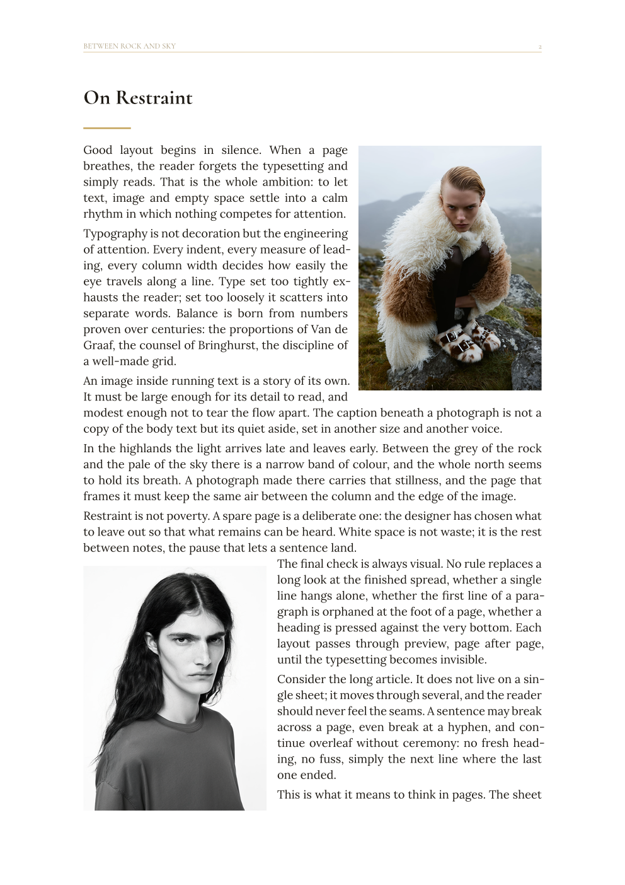
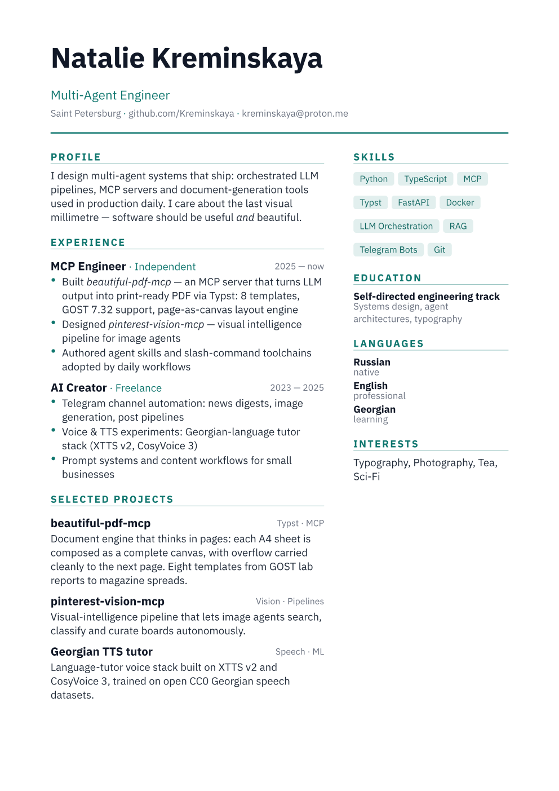

# beautiful-pdf-mcp


[](https://python.org)
[](LICENSE)
[](https://typst.app)
[](https://modelcontextprotocol.io)

MCP server that gives AI agents the ability to generate **typographically correct PDFs** via [Typst](https://typst.app) — with proper fonts, margins, spacing, and layout that actually holds together.

## Why

I asked an AI to generate a PDF resume. The result: a photo split across three pages, a tiny font paragraph, an entire blank page, then a giant image bleeding off the margins.

The problem isn't the AI — it's that generating layout-correct documents requires knowledge of a few hundred years of typographic rules. This server encodes those rules (Butterick, Bringhurst, GOST 7.32, Van de Graaf canon) into presets and exposes them as MCP tools. The agent picks a template, adds content, and gets a PDF compiled by a real typographic engine — not an HTML export dressed up as a document.

## Templates

| Template | Use case | Format | Body font |
|---|---|---|---|
| `report` | Business report, analytics | A4 | Source Serif 4 |
| `academic_ru` | Thesis, research paper (GOST 7.32) | A4 | PT Serif 14pt |
| `book` | Long-form, non-fiction | A5 | PT Serif |
| `technical` | API docs, developer guides | A4 | IBM Plex Sans |
| `portfolio` | Portfolio, showcase | A4 | Noto Sans |
| `letter` | Official correspondence | A4 | Source Sans 3 |
| `journal` | Magazine / editorial layout | A4 | Lora + Cormorant |
| `resume` | Modern two-column CV | A4 | IBM Plex Sans |

## Layout engine: the page is the unit of design

Most generated PDFs fail the same way: blocks are dropped onto the paper one
after another, and wherever they land, they land — half-empty pages, stranded
images, headings glued to the bottom margin. This server is built around the
opposite idea: **every page is composed as a complete canvas**, and whatever
doesn't fit is carried cleanly to the next page.

- **Magazine spreads** (`journal`) — a story with two photos lays them out
  diagonally (one top-right, one bottom-left) and threads a single continuous
  text around both, filling the page to the bottom. Overflow continues
  overleaf as plain prose — no repeated heading, like a book. Powered by
  [meander](https://typst.app/universe/package/meander/).
- **Auto-fit single-page documents** (`resume`, `letter`) — the template
  measures itself at several scales and picks the largest that still fits one
  sheet, so a short CV gets bigger type and more air instead of a half-empty
  page. Business letters scale conservatively.
- **Standards-aware composition** (`academic_ru`) — GOST 7.32 enforced
  structurally: each section starts on a fresh page, figures sit right after
  their first mention with text continuing below, tables span the full text
  measure with captions above.
- **No rivers** — justified text uses aggressive hyphenation costs, so lines
  pack tight instead of stretching into word gaps, even in narrow columns
  beside wrapped photos.

## Previews

<table>
<tr>
<td><br><sub>journal</sub></td>
<td><br><sub>resume</sub></td>
<td><br><sub>academic_ru</sub></td>
<td><br><sub>book</sub></td>
</tr>
<tr>
<td><br><sub>report</sub></td>
<td><br><sub>technical</sub></td>
<td><br><sub>portfolio</sub></td>
<td><br><sub>letter</sub></td>
</tr>
</table>

## Requirements

- Python 3.10+
- [Typst](https://typst.app) — `brew install typst` or [download](https://github.com/typst/typst/releases)
- `pip install fastmcp Pillow`

## Installation

```bash
git clone https://github.com/Kreminskaya/beautiful-pdf-mcp
cd beautiful-pdf-mcp
pip install -r requirements.txt
```

Verify Typst is available:
```bash
typst --version  # should print 0.12.0 or higher
```

## MCP configuration

Replace `/absolute/path/to/beautiful-pdf-mcp` with the real path to the cloned repo.

### Claude Desktop

`~/Library/Application Support/Claude/claude_desktop_config.json`:

```json
{
  "mcpServers": {
    "beautiful-pdf": {
      "command": "python3",
      "args": ["/absolute/path/to/beautiful-pdf-mcp/src/server.py"]
    }
  }
}
```

Restart Claude Desktop. You should see the tools listed below starting with `beautiful-pdf__`.

### Cursor

`~/.cursor/mcp.json` (or **Cursor → Settings → MCP → Add server**):

```json
{
  "mcpServers": {
    "beautiful-pdf": {
      "command": "python3",
      "args": ["/absolute/path/to/beautiful-pdf-mcp/src/server.py"]
    }
  }
}
```

### Any other MCP-compatible agent

Same JSON block — works with any client that supports the MCP stdio transport.

## Tools

| Tool | Description |
|---|---|
| `create_document` | Create a new document, returns `doc_id` |
| `add_section` | Add a section with Markdown content |
| `update_section` | Update title or content of an existing section |
| `remove_section` | Remove a section from the document |
| `add_image` | Add an image (PNG, JPG, SVG) with caption and position |
| `add_gallery` | Add a grid of images — auto-distributes across columns |
| `add_table` | Add a table with headers and rows |
| `add_code_block` | Add a syntax-highlighted code block |
| `add_callout` | Add a callout box (info / warning / tip / danger / quote) |
| `compile_preview` | Render pages as PNG — check layout before final compile |
| `compile_pdf` | Compile the final PDF |
| `save_document` | Export document state to JSON for persistence |
| `load_document` | Restore a previously saved document |
| `get_document_state` | Inspect current document state |
| `list_documents` | List all active documents in session |

## Usage

```python
# Create a document
doc = create_document(
    title="Q2 2025 Report",
    author="Natalie",
    template="report",
    language="en",
    preset_overrides={"accent_color": "#e63946"}  # custom accent colour
)
doc_id = doc["doc_id"]

# Add sections with Markdown content
s1 = add_section(doc_id, "Introduction", "**Key findings** from this quarter.", level=1)
add_callout(doc_id, s1["section_id"], "Revenue grew 18% QoQ — ahead of forecast.", kind="tip")

s2 = add_section(doc_id, "Data", "Results by region.", level=1)
add_table(doc_id, s2["section_id"],
    headers=["Region", "Revenue", "Growth"],
    rows=[["EMEA", "$4.2M", "+18%"], ["APAC", "$3.1M", "+31%"]],
    caption="Q2 revenue by region"
)

# Add images — centered (default) or wrapping around text
add_image(doc_id, s2["section_id"],
    path="/path/to/chart.png",
    caption="Figure 1. Revenue trend",
    width="large"
)
add_image(doc_id, s2["section_id"],
    path="/path/to/portrait.png",
    width="35%",
    position="right-wrap"   # text flows left of the image
)

# Gallery: multiple images in a grid
s3 = add_section(doc_id, "Portfolio", "Selected work.", level=1)
add_gallery(doc_id, s3["section_id"],
    paths=["/img1.png", "/img2.png", "/img3.png", "/img4.png"],
    columns=2,
    caption="Project screenshots"
)

# Always preview before final compile
preview = compile_preview(doc_id, pages="1-3")

# Save state (survives agent restarts)
save_document(doc_id, "~/Desktop/report.json")

# Compile final PDF
pdf = compile_pdf(doc_id, output_path="~/Desktop/report.pdf")
```

## Image positioning

| `position` | Behaviour | Available in |
|---|---|---|
| `"center"` (default) | Standalone centered figure | all templates |
| `"right-wrap"` | Text wraps to the left of the image | report, book, technical, portfolio, letter, journal |
| `"left-wrap"` | Text wraps to the right of the image | same as above |

`academic_ru` always places images centered — GOST 7.32 does not allow text wrap around figures.

`journal` wraps images automatically by default (alternating sides), without specifying `position` per image. Use `position="center"` to force a standalone figure.

## Fonts

21 font files bundled in `assets/fonts/` — no system fonts required:

| Family | Fonts | Character |
|---|---|---|
| **PT** | PT Serif, PT Sans, PT Mono | Full Cyrillic, GOST-compliant |
| **Source** | Source Serif 4, Source Sans 3, Source Code Pro | Professional quality (Adobe) |
| **IBM Plex** | Plex Serif, Plex Sans, Plex Mono | Technical, high-legibility |
| **Noto** | Noto Serif, Noto Sans | Maximum Unicode coverage |
| **Editorial** | Lora, Cormorant | Warm calligraphic pair for journal |

All fonts are open source (SIL OFL / Apache 2.0).

## Style system

Typographic parameters are defined in `data/styles.json` — body size, leading, margins, heading sizes, accent colours. Each template maps to a preset. Edit the JSON to customize any preset without touching the templates.

### Per-document overrides

Pass any typographic parameter directly to `create_document` — no file editing needed:

```python
doc = create_document(
    title="Annual Review",
    template="report",
    preset_overrides={
        "accent_color":  "#2a9d8f",
        "heading_color": "#264653",
        "body_font":     "PT Serif",
        "show_toc":      False,
        "margin_left":   "3.0cm",
    }
)
```

Overridable keys: `accent_color`, `heading_color`, `muted_color`, `body_color`, `body_font`, `heading_font`, `mono_font`, `text_size`, `h1_size`, `h2_size`, `h3_size`, `margin_left`, `margin_right`, `margin_top`, `margin_bottom`, `leading`, `show_toc`, `show_header_footer`, `numbered_headings`.

Built-in colour themes in `data/styles.json` → `color_themes`: `navy`, `ibm-blue`, `teal`, `emerald`, `amber`, `violet`, `crimson`, `slate`, `classic`, `monochrome`.

## Agent workflow

See [`SKILL.md`](SKILL.md) for the recommended workflow and an antipattern checklist (widows, orphans, hanging headings, corridor spacing).

## License

MIT
